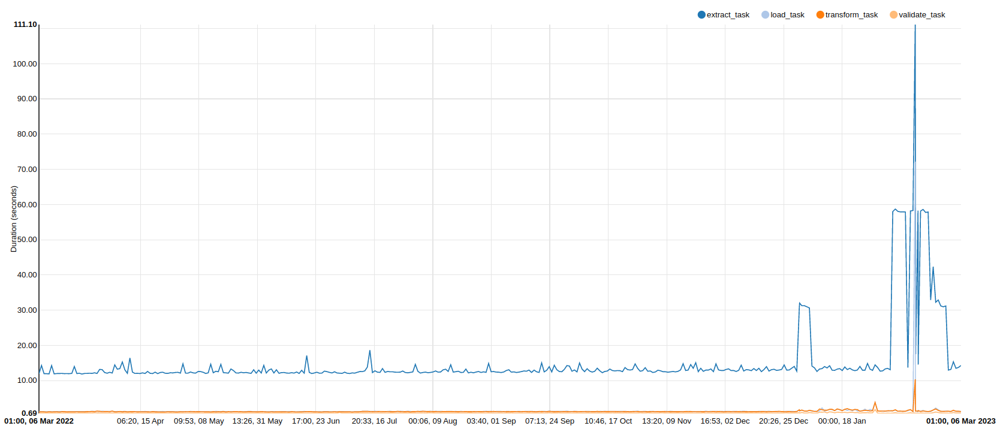

# Smart Home - Heating Data Project

Analysing data from smart thermostat using Tado API.

## High-level summary

- **Data pipeline (ETL)** using `Airflow`
    - Running Airflow locally (via `docker compose`)
    - DAG backfill over full 2022 year's data
    - Daily load (upsert) to `Postgres` DB
    - API requests using `PyTado` ([link to repo](https://github.com/wmalgadey/PyTado))
    - JSON schema validation using `Pydantic`
    - Transform + normalisimg JSON using `Pandas`
    - DB operations using `SQLAlchemy (core)`
- Extracted tables into `Jupyter` notebook environment for exploration
- `.py` scripts written for preprocessing pipeline
    - Data cleaning, deduplication etc
    - Merged and resampled at unified rate 1 minute intervals (1/60 Hz)
- **[IN-PROGRESS]** 
    - Tidy Visualisations, Dashboarding the results
    - Compute aggregate heating system metrics over the full 2022 year's data
    - Anomaly detection to highlight unusual heating days. E.g. is heating usage weather dependent or not?

---

# Prerequisites
- Docker installed
- VSCode installed with Dev Containers ext.

Some environment variables are required to run the Airflow dag

```bash
AIRFLOW_VAR_TADO_USERNAME=...
AIRFLOW_VAR_TADO_PASSWORD=...
AIRFLOW_UID=...
AIRFLOW_IMAGE_NAME=...
AIRFLOW_DB_CONNECTION_STRING=...
POSTGRES_USER=...
POSTGRES_PASSWORD=...
```

# Data pipeline - Airflow

I used Airflow for task orchestration and wrote a DAG which breaks up the extract, transform, load (ETL) steps into discrete operations with clear dependencies.


Airflow is suited to orchestration and not execution engine, so all my tasks are built using `DockerOperator` to isolate each task's Python environment and emulate running on multiple worker machines.

Intermediate results are saved to a shared/mounted folder and metadata tracked using XCOMs.

With enough **data validation** and error handling I was able to run this DAG **with a backfill** for the full 2022 calendar year.


Run duration is "*dominated by data extraction time** as we request historical data for all "zones" with a delay between requests. 
During backfill each daily DAG run duration stabilised to <20s.



# Docker containers

All elements of this project were designed to be run inside docker containers. My development environment is using a VSCode devcontainer defined in [devcontainer.json](.devcontainer/devcontainer.json). Should be possible to use this with Github Codespaces too.

My `docker-compose.yaml` is a customised version of the [airflow template](https://airflow.apache.org/docs/apache-airflow/2.5.0/docker-compose.yaml) and configures all the airflow services (scheduler, webserver etc) in addition to my Postgres local database (I might move this to an RDS instance later).

# Makefile

A `Makefile` is provided with several helpful commands for spinning up the airflow services on your machine.

## Spin up and down all containers

Using docker compose we can spin up the Airflow containers and postgres DB etc using the commands below:

```bash
# Init and spin up the containers
make containers_build
make containers_init
make containers_up

# Spin down the containers
make containers_down
```

The Airflow web UI should be available at http://localhost:8080

---

## Just some handy commands
```bash

# Commands for getting into psql terminal
docker exec -it <container_name> bash   # Connect to bash inside postgres container
psql -U postgres -d postgres            # Connect to database in psql shell
\l                                      # List databases
\dt                                     # List tables
pg_dump -U postgres -W -F t postgres > /backups/house_climate_pg_dump.tar # Create backup
aws s3 sync backups s3://house-climate  # Upload to S3 bucket

```